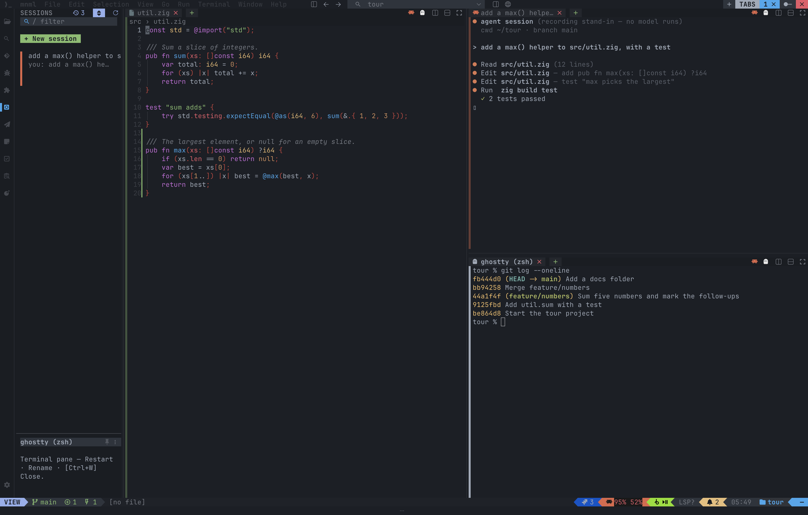
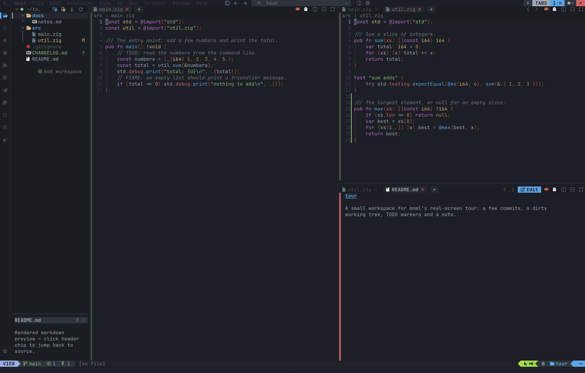
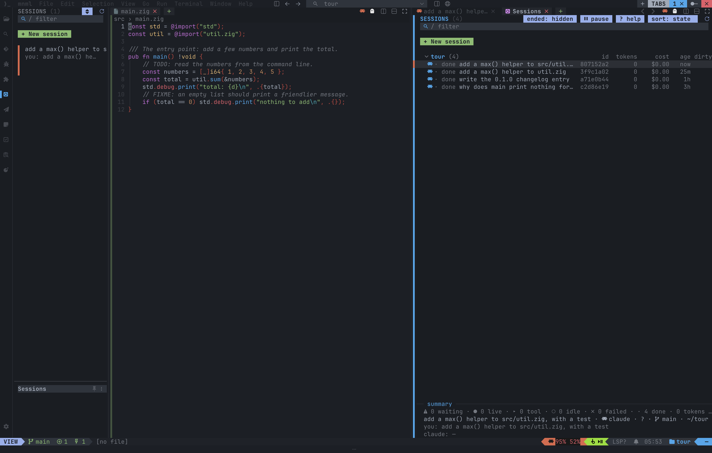
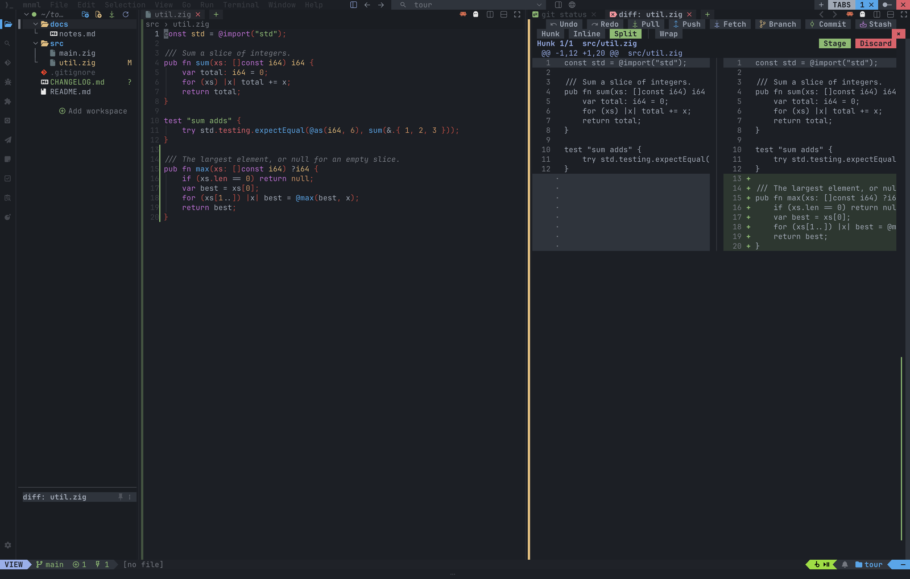
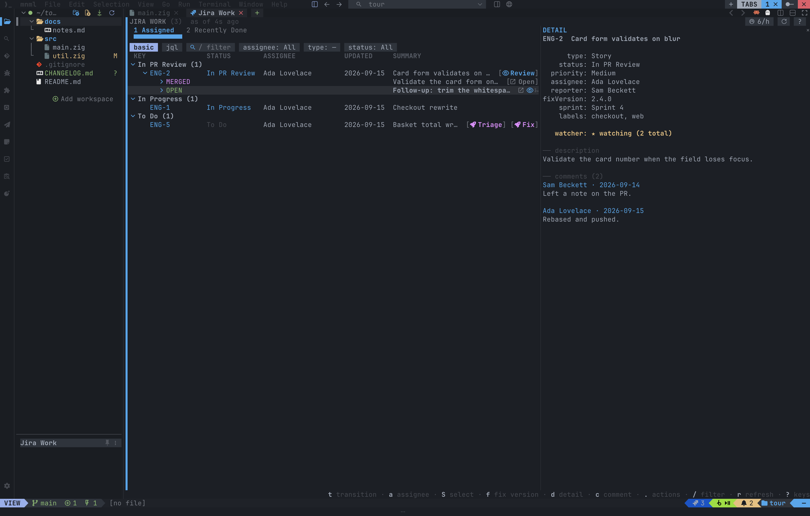

# mnml

[](https://github.com/chris-mclennan/mnml/releases/latest)
[](https://github.com/chris-mclennan/mnml/actions/workflows/ci.yml)
[](#license)
[](https://ziglang.org)

Everything you'd open a second terminal for, in one NvChad-style window:
editor, git, agents, HTTP — written in Zig, on libghostty, scripted in Lua.



<table>
  <tr>
    <td width="50%"><br>Split right and down, a file in each, tab pages on top.</td>
    <td width="50%"><br>Agent sessions in panes next to your code, listed in the SESSIONS rail.</td>
  </tr>
  <tr>
    <td width="50%"><br>Status, diff, stage and commit without leaving the editor.</td>
    <td width="50%"><br>Jira as a tab, installed from the Marketplace (here an offline fake server).</td>
  </tr>
</table>

<!-- Try it in your browser: https://mnml.sh/demo -->

## What it is

A terminal IDE. Vim *or* standard (VS Code-style) editing, as two complete
keymap profiles picked with `--input`, without `if vim {}` scattered through
the codebase. NvChad's chrome — file tree, tabline, statusline, Nerd Font
devicons, tree-sitter highlighting — with a command palette, right-click
menus and the mouse. LSP and a debugger (DAP); git status, diff, staging and
commits; an HTTP client for `.http` / `.curl` files and request chains;
terminal panes rendered by libghostty; Claude Code and Codex sessions in
splits beside your code. Jira and Bitbucket install from the Marketplace,
`docs/SDK.md` covers writing your own integration, and `init.lua` scripts
the rest. Written in Zig — one binary per platform, no runtime to install.

mnml 0.3.0 onward is this codebase. mnml 0.2.x was a Rust build, frozen at
0.2.22 and archived at
[chris-mclennan/mnml-rust](https://github.com/chris-mclennan/mnml-rust);
the command ids and the `.test` corpus carry over.

## Install

Prebuilt, no toolchain — macOS and Linux (x86_64, aarch64), Windows (x86_64).

macOS (aarch64) and Linux are **verified**: the whole gate — the unit
suite, the width sweep, the `.test` corpus, the pty mouse check and
packaging — runs on both (`tools/linux/run.sh`, and see
`docs/CONTRIBUTING.md` → *Running the gate on Linux*). Windows is
**compiled, not yet run**: `zig build gate-targets` builds the exe and
every test binary for all five shipped targets, `x86_64-windows-gnu`
among them, on each merge, which is enough to
catch a target-gated branch that does not compile and not enough to catch
one that does not work. `docs/WINDOWS.md` is the honest ledger of that,
and `docs/INSTALL-CHECKLIST.md` is what to walk on a clean guest of any
of the three.


```sh
# macOS / Linux — into ~/.local/bin (MNML_INSTALL_DIR to change it)
curl --proto '=https' --tlsv1.2 -LsSf https://github.com/chris-mclennan/mnml/releases/latest/download/mnml-installer.sh | sh

# Homebrew (macOS / Linux)
brew install chris-mclennan/tap/mnml
```

```powershell
# Windows — into %LOCALAPPDATA%\mnml\bin, added to your user PATH
powershell -ExecutionPolicy Bypass -c "irm https://github.com/chris-mclennan/mnml/releases/latest/download/mnml-installer.ps1 | iex"

# winget
winget install ChrisMcLennan.mnml
```

That installs mnml and nothing else — one binary per platform. The
integrations (Jira, Bitbucket, the SDK sample) are released on their
own tags in this repo; the first-launch setup offers Jira and Bitbucket
as checkboxes, and the INTEGRATIONS section's Marketplace tab lists the
rest. Either installs the build for your platform from the index that
ships with your mnml release, checking its sha256 first
(`docs/RELEASE.md`, "Integrations").

Debian / Ubuntu and Fedora / RHEL packages sit on every release as
`mnml-<triple>.deb` / `.rpm`; the raw archives (`mnml-<triple>.tar.xz`,
`.zip` on Windows) each come with a `.sha256`. Every shipped binary is a
ReleaseSafe build for a baseline CPU. A [Nerd Font](https://www.nerdfonts.com/)
is recommended; `--ascii` works without one.

Coming from 0.2.x: config is `config.zon` now, written beside your
`config.toml` and never touching it. Run `mnml export-config-zon` on 0.2.22
once. `docs/CONFIG.md` is the complete commented file.

## Command line

The installed binary is `mnml` (`mnml.exe` on Windows); a source build is
`zig-out/bin/mnml-zig`. `mnml --help` prints the whole usage line.

```sh
mnml [WORKSPACE] [FILE…]        # open a workspace (default: the cwd), and files in it
  --input vim|standard          # the keymap profile for this launch (docs/KEYMAP_PROFILES.md)
  --ascii                       # no Nerd Font glyphs — the terminal and --headless alike
  --config PATH                 # one more config layer, applied last and always trusted
  --no-session                  # do not restore the saved session
  --startup-picker              # open on the startup picker (new file, recent files, workspaces)
  --profile dev|stable          # which data root, session file and IPC mailbox
  --sandbox [--sandbox-keep]    # a throwaway HOME and data root, removed on exit unless kept
  --demo                        # a sandbox with a sample workspace, offline Jira + Bitbucket and a stand-in Claude (no network)
  --headless                    # a virtual screen driven by file IPC under <ws>/.mnml/ (MNML_COLS / MNML_ROWS size it)
mnml --version
mnml test [PATH…]               # run .test scripts (below)
mnml run FILE | chain run FILE | discover SPEC   # the HTTP client, no UI
```

## Build from source

[Zig 0.16.0](https://ziglang.org/download/) exactly — `build.zig.zon` pins it
as `minimum_zig_version`, and the pipeline runs on nothing else. Dependencies
(vaxis, libghostty-vt, the tree-sitter grammars) are fetched by `zig build` and
verified by hash; there is no system library to install.

```sh
zig build                                   # zig-out/bin/mnml-zig, Debug
zig build -Doptimize=ReleaseSafe            # what ships
zig build test                              # the unit suite, then the e2e gate (leak = failure)
zig build unit                              # the unit suite alone
zig build test -Doptimize=ReleaseSafe
zig build gate-build -Dtarget=x86_64-windows-gnu -Doptimize=ReleaseSafe
                                            # cross-compile exe + every test binary, no run
zig build gate-targets                      # gate-build for all five shipped targets, in turn
zig build check                             # fmt, tests in both modes, the gate, the sweep, the corpus
zig build e2e                               # the .test corpus alone (`-- ARGS` reach `mnml-zig test`)
zig build docs                              # regenerate docs/commands.md from the spec table
zig build glyph-audit                       # every Nerd Font glyph in src/, the SDK and integrations/ has its --ascii twin
zig build release                           # all five targets → zig-out/release/<triple>/
zig build dist -Dversion=0.3.0              # + archives, sha256s, installers, manifest → zig-out/dist/
```

`./run.sh` is the way to run a dev build — it builds only when a source is
newer than the binary, launches on the directory you ran it from, and
relaunches on exit 75 (the restart handshake):

```sh
./run.sh                    # build if stale, open the cwd, relaunch on restart
./run.sh ~/some/proj --input vim --ascii --config PATH   # a workspace; flags pass through
./run.sh restart            # rebuild + relaunch the running instance (IPC {"cmd":"restart"})
./run.sh stop               # quit it ({"cmd":"quit"})
./run.sh status             # its workspace, IPC dir, whether the process is alive
./run.sh fresh              # launch without restoring the session (--no-session)
./run.sh WS --sandbox       # a throwaway HOME + data root: what a new user sees; removed on exit
./run.sh headless [WS]      # the same loop with --headless (virtual screen + file IPC)
./run.sh shot [OUT.png]     # screenshot the real ghostty window (macOS; scripts/shot.sh)
./run.sh check              # the verification sequence below, in one line
./run.sh install [--dry-run]  # install this build as the mnml you live in (PREFIX=~/.local)
./run.sh installed-status   # what is installed, against this tree's HEAD
./run.sh install-font [--dry-run]  # merge this build's MnmlSymbols font into the installed one
./run.sh build | release | test | stale | clean [incremental|all] | menu | help
```

A launch from `run.sh` runs in the **dev profile**: its own data root
(`~/.config/mnml-dev`), its own session file (`.mnml/session-dev.zon`),
its own IPC mailbox and marker, and a `dev` chip on the statusline — so
you can daily-drive the installed `mnml` and develop this one in the
same workspace at the same time. `./run.sh install` is how the
installed one catches up. `docs/CONFIG.md` → *Profiles*, and
`docs/CONTRIBUTING.md` → *Daily driver + development on one machine*.

`-Dversion=` is what `--version` prints; without it a dev build prints the
manifest version, the git short SHA and `-dirty` (`0.3.0-dev+g76ccf5b-dirty`).
`-Dipc-subdir=` and the marker name keep a dev build's IPC beside a running
0.2.x (`ipc-zig`, and `${TMPDIR:-/tmp}/mnml-zig-running-$USER.workspace`, which the
app writes on start and removes on a clean exit — `run.sh` finds the instance
through it).

Before offering a change, the sequence in `docs/CONTRIBUTING.md` → *The
gate*: the work-data audit, fmt, the arena audit, `-Dpartial=false`,
the unit tests in ReleaseSafe, the Windows compile, the glyph audit, a
ReleaseSafe build, the width sweep and the corpus on that build,
`tools/pty-mouse-check.py`, the two integrations' own suites,
`tools/run-sh-check.sh`, and `zig build docs` leaving
`docs/commands.md` unchanged — plus the chrome and hover audits, the
cursor pty check and `tools/ui-diff.sh` when the change reaches them.
`./run.sh check` is a subset in one line: fmt, the unit tests in Debug
and ReleaseSafe, the e2e gate in Debug, the ReleaseSafe build, the sweep, the corpus, the
glyph, chrome and hover audits, `zig build gate-targets` (every
shipped target compiled), `tools/run-sh-check.sh` and
`tools/run-ps1-check.py`. `tools/linux/run.sh all` runs the build, the
audits, the unit suite, the gate and the corpus inside a
Linux container — do that for anything touching a process, a thread, a
path, a filesystem assumption or a spawned tool.

## AI ghost text, and what leaves your machine

Ghost text — the grey suggestion at the cursor, Tab to take it — has
three backends, chosen with `ai.setup_suggestions` or
`ai.suggest_backend`:

| backend | what it sends, and where |
|---|---|
| `claude-code` | the ~2000 characters before and ~1000 after the cursor, to Anthropic, through your own `claude` CLI and plan |
| `claude-api` | the same window, to Anthropic, with your `$ANTHROPIC_API_KEY` |
| `copilot` | the **whole open file**, to GitHub, through Copilot's own language server — and only once you opt in, per workspace |

Nothing at all is sent while `inline_suggestions = false`, or while the
backend is unset.

### GitHub Copilot is off until a workspace opts in

Copilot's protocol is document-based, not window-based: it wants
`didOpen` and `didChange` for the file you are editing, so choosing it
means whole files leave the machine. mnml therefore treats the
**workspace**, not the setting, as the unit of consent.

Four things must all be true before one byte is sent:

1. `ai.suggest_backend = "copilot"`;
2. **this workspace opted in** — `ai.copilot_here = true` in
   `<workspace>/.mnml/config.zon`, which `ai.copilot_enable_here`
   writes. It is `false` by default and there is no key that opts in on
   another workspace's behalf;
3. **the workspace is trusted.** `ai.copilot_here` is a trust-gated key
   (`docs/CONFIG.md`, "Workspace trust"), so a repo you cloned cannot
   opt you in by shipping a config: untrusted, it reads as `false`, and
   trusting the workspace lists it as a claim you accept by name;
4. **the file is not excluded** — `ai.copilot.exclude` globs (default
   `.env*`, `*.pem`, `*.key`, `id_*`), plus the secret-looking-name
   list every backend already honours, plus anything **gitignored**.

A file that fails (4) is never opened on the server either, because
opening it would already have sent it. The server itself is not even
started until (1)–(3) hold.

    ai.copilot_status          what is shared right now, and why or why not
    ai.copilot_enable_here     opt this workspace in
    ai.copilot_disable_here    opt it back out (the server stops)
    ai.copilot_sign_in         device code + the URL to enter it at
    ai.copilot_sign_out

mnml never downloads the Copilot server. It runs
`copilot-language-server` from your `PATH`
(`npm i -g @github/copilot-language-server`), or exactly the argv you put
in `ai.copilot.command`; a missing binary is one toast with the install
line, not a silent no-op. GitHub's own content-exclusion rules apply on
top of all of this — the chip reads `file excluded` when they fire.

`docs/research/copilot-backend-2026-09-21.md` records which parts of the
protocol were verified, and from where.

## The `.test` oracle

The end-to-end suite is a line-based script format — `write`, `open`, `key`,
`type`, then `expect screen | status | file | dirty | pane` — run headlessly against the
same `App` the terminal drives. The corpus in `tests/e2e` is the Rust
repo's suite, copied here when Rust froze, plus the scripts written for this
codebase; it is the definition of parity: 1101 `.test` files (2026-09-29, the
`http/` and `http_panel/` subfolders included), every one run at 120x40
but the `# requires: network` file. `zig build test
--summary all` prints the unit suite's count.

```sh
./zig-out/bin/mnml-zig test                          # the whole corpus
./zig-out/bin/mnml-zig test --gate                   # the 52-file Phase-0 gate (tools/gate.txt)
./zig-out/bin/mnml-zig test --gate --sizes 80x24,120x40,200x60
./zig-out/bin/mnml-zig test tests/e2e/edit_and_save.test
```

Every file runs on a `DebugAllocator` with safety on and asserts a clean
`deinit`; at 80x24 and 200x60 the assertion is no panic, no leak, no rect
outside its parent. `mnml-zig test` runs the files that spawn a shell unless
`MNML_E2E_ALLOW_SHELL` is set to something other than `1`, and the
`# requires: network` file only with `MNML_E2E_NETWORK=1`. The debugger's scripts run against `mnml-fake-dap` (`tools/fake_dap/`,
installed by `zig build`): a deterministic Debug Adapter the runner exports as
`MNML_FAKE_DAP`, so the debug UI is tested for real on every platform with no
toolchain. `tools/debug-demo.sh` opens the same setup on a real screen.

## Where things are

- `docs/DESIGN.md` — the design: architecture decisions D1–D10, the phase plan,
  the release pipeline (E6), the safety gates (E7), the cutover checklist —
  annotated with dated `// changed:` notes where the tree departs from it.
- `docs/PARITY.md` — the parity ledger against the Rust `FEATURES.md`, one row
  per feature with the file that proves it; the cutover decision reads it.
- `docs/commands.md` — every command id, group and default chord (generated).
- `docs/ui-spec/` — the Rust editor's screen dumps the chrome is measured
  against (`tools/ui-diff.sh`), and the Zig-authored debug screens
  (`tools/zig-spec.sh`).
- `docs/CONVENTIONS.md` — what a diff is checked against.
- `docs/CONFIG.md` — the complete commented `config.zon`.
- `docs/KEYMAP_PROFILES.md` — the vim and standard profiles: every chord that
  differs, the debugger's two doors, the section moves.
- `docs/LUA.md` — scripting: `init.lua`, the `mnml.*` API, hooks and tasks.
- `docs/SDK.md` — writing an integration: the SDK, its manifest, the bridge.
- `docs/CONTRIBUTING.md` — worktrees, commits, the oracle, the verification
  sequence, break-checks.
- `docs/RELEASE.md` — cutting a release, and the two traps in it.
- `docs/INSTALL-CHECKLIST.md` — the per-OS first-run checklist (macOS,
  Ubuntu, Windows 11): what to install, what a pass looks like at every
  step, and the UTM snapshot routine the guests are kept on.
- `docs/WINDOWS.md` — what is implemented on Windows, what has been
  proven and how, and what is still open.
- `CHANGELOG.md` — what a user notices, release by release.
- The manual: [mnml.sh](https://mnml.sh).

## License

MIT or Apache-2.0, at your option — `LICENSE-MIT`, `LICENSE-APACHE`.
