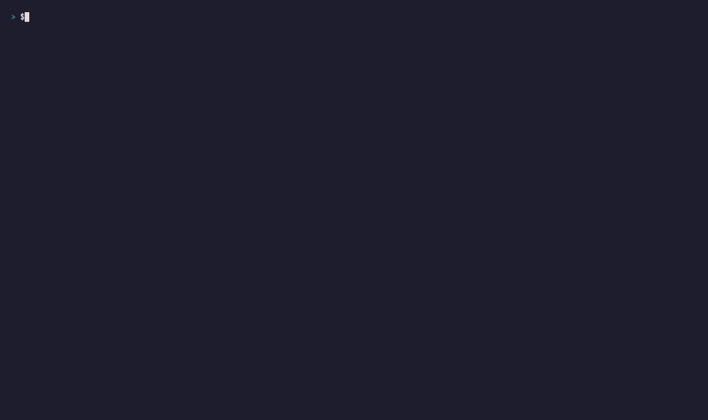

mnml's chrome wraps the editor on three sides: the file rail and activity bar on the left (toggled by `Ctrl+B`), the statusline + bufferline at top and bottom, and — since 2026-06-28 — a **right side panel** that mirrors the rail on the opposite edge. The right panel is the home for panes that read better as a vertical sidebar than as a horizontal split: the Outline (`outline.show`) and the project-wide Diagnostics list (`lsp.diagnostics`). When the panel is visible, those two commands route their pane *into* the panel instead of carving a split out of the editor body.



The panel is opt-in. It opens with `Ctrl+Shift+B` (the natural mirror of `Ctrl+B`), it can be sized by dragging its left edge, it persists across restarts via `session.json`, and it has a one-cell `×` close button on its header so you can evict the hosted pane without closing the column itself.

## Opening and closing

| Gesture | What it does |
|---|---|
| `Ctrl+Shift+B` | Toggle the panel. Fires `view.toggle_right_panel`. |
| `:set rightpanel` | Open the panel (idempotent — already-open stays open). |
| `:set rightpanel!` | Toggle (vim-style `invrightpanel` is the long form; `:set rp!` is the short form). |
| `:set norightpanel` | Close the panel. |
| Click the palette-bar's right-panel chip | Toggle. Same command. |

`Ctrl+Shift+B` is VS Code's "Run Build Task" chord. mnml has no build-task concept yet, so the chord is repurposed for the panel toggle; if a task runner lands later, the binding may need revisiting (`Ctrl+Alt+B` is the next pick). The palette command (`view.toggle_right_panel`) calls this out in its title so a porter sees the conflict.

The panel's visibility, width, and currently-hosted pane id all round-trip through `<workspace>/.mnml/session.json`, so restart mnml and the panel comes back exactly as you left it.

## Hosted panes (v3 + v4 tab strip)

![open lib.rs, open the panel, outline.show + lsp.diagnostics both host as TABS, click between them or use Ctrl+Shift+[ / Ctrl+Shift+] to cycle, × closes the active tab, panel stays open](../../../assets/tapes/right-panel-v2-hosting.gif)

Three commands route their pane into the panel as a **tab** when it's open:

- **`outline.show`** — the LSP Outline pane (symbols sidebar for the active file). Default chord `<leader>lo` (vim) or palette. Tab label shows `<filename> ⌥<symbol-count>`.
- **`lsp.diagnostics`** — the workspace-wide Problems list. Default chord `<leader>le` (vim) or palette. Tab label shows `problems ✗<errors> ⚠<warnings>`.
- **`ai.chat`** / `ai.ask` / `ai.explain` / … — the AI chat pane (v4, 2026-06-28). Tab label shows `<title> ●/✦/✗/…` (state-marker). When the panel column is narrower than 40 cells, a one-line hint at the top of the chat body suggests dragging the edge wider.

When the panel is **closed**, these commands fall back to their pre-panel behavior: Outline splits horizontally above the active editor; Diagnostics opens a vertical split below the focused leaf; AI opens as a horizontal split next to the editor. When the panel is **open**, the pane is pushed into `app.right_panel_panes` as a new tab — the editor body keeps its full width, and the panel renders the active tab inside its column.

The tab strip caps at **3** simultaneous tabs. Pushing a 4th displaces the oldest (FIFO) with a toast so you know what happened. Tabs you don't see scroll off the right edge — the label truncates with `…` so long titles still fit.

### Switching, closing, opening

| Gesture | What it does |
|---|---|
| `Ctrl+Shift+]` (or `<leader>t]`) | Switch to the next tab in the strip |
| `Ctrl+Shift+[` (or `<leader>t[`) | Previous tab |
| `<leader>tx` | Close the active tab |
| Click a tab chip | Switch to that tab |
| Click the `×` button | Close the active tab |
| Right-click an inactive tab | Menu: Switch to this tab / Close tab / Hide side panel |
| Right-click the active tab | Menu: Close tab / Hide side panel |
| Click `:outline.show` / `:lsp.diagnostics` in the empty state | Fires that command directly — mouse path to populate the panel |

### Empty state

With the panel open but no pane hosted, the body paints a faint hint:

```
 SIDE PANEL

  Nothing here yet.

  :outline.show
  :lsp.diagnostics

  Hide with Ctrl+Shift+B.
```

The hint is comment-colored on the panel's slightly-darker background. The two ex commands are both real — copy-and-paste them into the cmdline and the pane lands inside the panel.

### Header and close button

When a pane is hosted, the panel's header reads ` OUTLINE` or ` DIAGNOSTICS` (bold, dim foreground). The far-right cell of the header is a clickable `×` (or `x` under `[ui] ascii_icons = true`) — clicking it **evicts the hosted pane** (`right_panel_pane_id = None`) but **keeps the panel open** in the empty state. The pane object stays in `app.panes` — firing `outline.show` again immediately re-hosts it.

This is the eviction split mnml makes for the panel:

| Gesture | Panel | Hosted pane |
|---|---|---|
| Click the header's `×` | Stays open (empty state) | Evicted from the panel (still in `app.panes`) |
| `Ctrl+Shift+B` (toggle off) | Closes | Evicted from the panel |
| `:set norightpanel` | Closes | Evicted from the panel |
| `view.toggle_right_panel` from the palette | Toggles | Evicted on close |

Either close path nulls `right_panel_pane_id`. Re-opening the panel returns to the empty-state hint — your hosted pane isn't auto-restored, because the design assumes you'll re-fire `outline.show` or `lsp.diagnostics` for whatever you want next.

## Sizing

The panel takes a fixed cell width carved off the right of the workspace area **before** the rail's left split happens, so the rail and the panel size independently. Default width comes from `[ui] right_panel_width` in TOML (auto-default if unset).

### Drag-resize

The panel's left edge has a 2-row visible grip (`┃` / `|` in ASCII mode) centered vertically. The hit zone is 3 cells wide × 4 rows tall — bigger than the visible grip so trackpad users don't miss. Click the grip and drag horizontally to resize; release commits the width to `app.right_panel_width` and the next session save.

Width is clamped at render time: the panel can't shrink the editor's middle column below 20 cells, and the panel itself can't go below 8 cells.

### "Too narrow" hint

Below **16 cells** the panel's body would render an unusable squeeze of the Outline or Diagnostics — gutter plus a fragment of each line, no room for the symbol names. Instead of painting that, the panel shows:

```
 OUTLINE

  too narrow — drag edge wider
```

The header still renders so you can see what's hosted. The body's hint stays until you drag the grip back past 16 cells or close the panel.

## Layout interaction

The panel column is independent of the split tree. Splits inside the editor body don't propagate into the panel — a vertical split is still a vertical split, just within a slightly-narrower middle column. The hosted Outline / Diagnostics pane lives in `app.panes` like any other pane, but its layout cell is the panel column instead of a leaf in `app.layouts`.

Practically, this means:

- The bufferline (when visible) spans the editor's middle column only, not the panel.
- Per-leaf tab strips (when splits exist) stay within their splits — the panel column has its own one-line header instead.
- Focus moves into the panel the same way it moves into other panes — clicking inside it sets `app.active` to the hosted pane id; `Esc` from inside the pane returns focus to the previous editor leaf.
- The drag-resize grip is checked **before** the left rail's grip in the layout-rect dispatcher, so dragging never accidentally moves the wrong column.

## Configuration

Two TOML keys cover the panel's defaults:

```toml
# ~/.config/mnml/config.toml
[ui]
right_panel_visible = false   # open the panel on startup
right_panel_width   = 32      # initial width in cells
```

Both also round-trip through `<workspace>/.mnml/session.json` — the workspace's last-saved width and visibility override the config defaults on re-open. Delete the session file (`rm .mnml/session.json`) to fall back to the TOML defaults.

The hosted-pane list (`right_panel_panes`) is **not** persisted across mnml restarts — re-fire `outline.show` / `lsp.diagnostics` / `ai.chat` after open to repopulate.

## What's still ahead

- **Pluggable hosts.** Only Outline, Diagnostics, and AI route into the panel today. Other panes (test output, grep, browser) are candidates for v5.
- **Overflow chevrons.** The 3-tab cap displaces FIFO with a toast; lifting the cap needs left/right scroll chevrons on the tab strip (same shape as the bufferline).
- **Persistent host list.** Saving `right_panel_panes` to `session.json` would re-host the panel exactly as you left it.

## Source

- `src/app/mod.rs` — `right_panel_visible`, `right_panel_width`, `right_panel_panes`, `right_panel_active_idx`, `right_panel_push`, `close_right_panel_hosted_panes`, `RIGHT_PANEL_MAX_TABS`.
- `src/ui/mod.rs` — the layout split that carves the column (`right_panel_area`), the tab-strip painter, the header / `×` / too-narrow / empty-state painters, the drag-grip indicator.
- `src/app/ex_commands.rs` — `:set rightpanel` / `:set rightpanel!` / `:set norightpanel`.
- `src/command.rs` — `view.toggle_right_panel` (`Ctrl+Shift+B`), `view.right_panel_{next,prev,close}_tab`.
- `src/app/lsp.rs` — `open_outline_pane` and `open_diagnostics_pane` (route into the panel when visible).
- `src/app/ai.rs` — `ask_ai` (routes AI chat into the panel when visible).
- `src/app/mod.rs::open_diagnostics_pane` — same routing for `lsp.diagnostics`.
- `src/app/session.rs` — visibility + width round-trip.

## Next

- [LSP](/manual/lsp/) — the symbols, outline, and diagnostics surfaces that the panel hosts
- [Activity bar](/manual/activity-bar/) — the chrome on the *opposite* edge (rail + activity strip)
- [Dock widgets](/manual/dock-widgets/) — the corner-pinned mini-panels above the editor body
- [Settings & configuration](/manual/settings/) — `[ui]` keys including `right_panel_visible` / `right_panel_width`
- [Chord chains](/manual/chord-chains/) — how `Ctrl+Shift+B` and the rest of the keymap resolve
